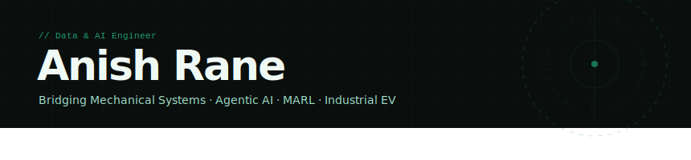

---

## `// about`

> I hold a foundation in **Mechanical Engineering** and have grown into a **Data & AI Engineer** focused on intelligent, autonomous systems for industry. I combine domain knowledge of thermodynamics and kinematics with **Generative AI** and **Multi-Agent Reinforcement Learning** to build pipelines that optimize efficiency and safety — particularly in the **automotive and energy sectors**.

---

## `// technical ecosystem`

<table>
<tr>
<td valign="top">

**AI & Machine Learning**
```
Agentic AI · RAG
MARL · Deep Learning
NLP · Computer Vision
LangChain · PyTorch · Scikit-Learn
```

</td>
<td valign="top">

**Industrial Domain**
```
Autonomous & Hybrid Vehicles
Predictive Maintenance
EV / HEV Systems
Thermodynamics · Kinematics
```

</td>
<td valign="top">

**Engineering & Cloud**
```
Python · SQL · C++
PyTorch · LangChain
Scikit-Learn
CI/CD · Git
```

</td>
</tr>
</table>

---

## `// featured projects`

<table>
<tr>
<td width="50%" valign="top">

### ⛽ [Industrial Fuel Optimization Pipeline](YOUR_REPO_LINK)
Modular ML pipeline using **Random Forest** to optimize fuel consumption in heavy mining equipment. Production-grade, high-stakes industrial ROI.


</td>
<td width="50%" valign="top">

### 🔍 [RAG-Based Policy Analyzer](YOUR_REPO_LINK)
End-to-end **Retrieval-Augmented Generation** interface for automated insurance policy analysis — full citation tracking & hallucination mitigation.


</td>
</tr>
<tr>
<td width="50%" valign="top">

### ⚡ [EV Energy Management Research](YOUR_REPO_LINK)
Investigating **Agentic AI** frameworks for real-time energy management in Hybrid & Electric Vehicles using Multi-Agent systems.


</td>
<td width="50%" valign="top">

### 🚧 More coming soon...
Currently building new projects in industrial AI and autonomous systems.

</td>
</tr>
</table>

---

## `// github stats`

<div align="center">
  
  
</div>

---

## `// current focus`

| 🔭 Architecting | 🌱 Researching | 🤝 Collaborating |
|:---|:---|:---|
| Intelligent agents for EV charging optimization and power management | Intersection of LLMs and Multi-Agent Reinforcement Learning | ADAS systems and open-source industrial AI frameworks |

---

<div align="center">

```
"Engineering is not just about moving parts —
  it's about the intelligence that guides them."
```

</div>
