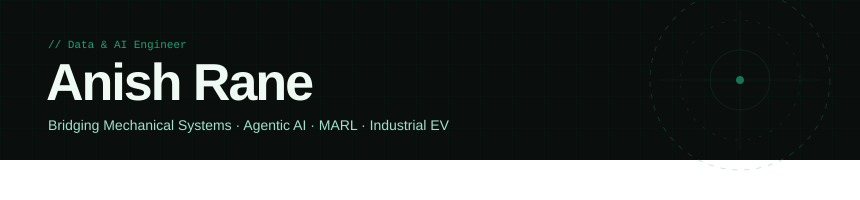

<div align="center">

[](https://www.linkedin.com/in/anish-rane/)
[](mailto:anishrane2000@gmail.com)
[](https://www.linkedin.com/in/anish-rane/)

**Data & AI Engineer** · MSc Machine Learning & AI (LJMU) · Mechanical Engineer · Pune, India

</div>

---

## `// about`

> I hold a foundation in **Mechanical Engineering** and have grown into a **Data & AI Engineer** focused on intelligent, autonomous systems for industry. I combine domain knowledge of thermodynamics and kinematics with **Generative AI** and **Multi-Agent Reinforcement Learning** to build pipelines that optimize efficiency and safety — particularly in the **automotive and energy sectors**.

- 🎓 **MSc in Machine Learning & AI** — Liverpool John Moores University
- 🏭 Currently at **Weichai Power**
- 💼 Open to **Data Scientist · ML Engineer · AI Engineer** roles in automotive, EV & industrial AI

---

## `// technical ecosystem`

<table style="margin-left: auto; margin-right: auto;">
<tr>
<td valign="top" align="left">

**AI & Machine Learning**
```
Agentic AI · RAG
MARL · Deep Learning
NLP · Computer Vision
LangChain · PyTorch · Scikit-Learn
```

</td>
<td valign="top" align="left">

**Industrial Domain**
```
Autonomous & Hybrid Vehicles
Predictive Maintenance
EV / HEV Systems
Thermodynamics · Kinematics
```

</td>
<td valign="top" align="left">

**Engineering & Tools**
```
Python · SQL · C++
ChromaDB · OpenAI API
Pandas · NumPy
CI/CD · Git
```

</td>
</tr>
</table>

---

## `// featured projects`

<table>
<tr>
<td width="50%" valign="top">

### ⛽ [Industrial Fuel Optimization Pipeline](https://github.com/AnishRane-cox/Mining-and-Heavy-Equipment)
Production-ready ML pipeline predicting fuel consumption (ton-km) in heavy mining equipment — modular architecture, cyclic feature engineering and automated pre-processing.


</td>
<td width="50%" valign="top">

### 🔍 [Insurance HelpMate AI — RAG](https://github.com/AnishRane-cox/Insurance-HelpMateAI)
End-to-end **Retrieval-Augmented Generation** system for complex insurance documents — OpenAI embeddings, ChromaDB vector search, cross-encoder reranking and grounded GPT answers.


</td>
</tr>
<tr>
<td width="50%" valign="top">

### 🌀 [Cylindrical Filter Simulator](https://github.com/AnishRane-cox/Cylindrical-Filter-Simulator)
High-fidelity Python simulator for cylindrical air filters — fluid dynamics, dust loading, material database and research-grade plots & reports.


</td>
<td width="50%" valign="top">

### 📊 [LLM Sales Analytics Agent](https://github.com/AnishRane-cox/LLM-AI-Analytic-Project)
LangChain + OpenAI agent for natural-language analysis of sales data — forecasting, anomaly detection, profitability and automated reporting tools.


</td>
</tr>
</table>

---

## `// in active development`

> 🔒 Currently private — available to walk through in interviews.

| Project | What it does |
|:---|:---|
| 🚗 **Autonomous Vehicle MARL** | Multi-Agent Reinforcement Learning for autonomous / hybrid vehicle control |
| 🔧 **Predictive Maintenance** | Failure prediction for industrial & powertrain components |
| 🛣️ **Real-World Duty-Cycle Library** | Library of real-world vehicle duty cycles for energy & fuel modelling |
| ⚡ **EV Energy Management** | Agentic AI for real-time energy management in HEV / EV systems |

---

## `// current focus`

| 🔭 Architecting | 🌱 Researching | 🤝 Collaborating |
|:---|:---|:---|
| Intelligent agents for EV charging optimization and power management | Intersection of LLMs and Multi-Agent Reinforcement Learning | ADAS systems and open-source industrial AI frameworks |

---

<div align="center">

```
"Engineering is not just about moving parts —
it's about the intelligence that guides them."
```

</div>
